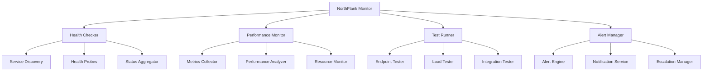

# 📊 NorthFlank Monitor

> **Real-time NorthFlank monitoring and testing system - Monitors all projects, services, and automatically tests endpoints**

[](https://github.com/MyMindVentures/NorthFlank-Monitor)
[](https://app.northflank.com)
[](https://github.com/MyMindVentures/NorthFlank-Monitor)

## 🎯 Overview

The **NorthFlank Monitor** is the vigilant guardian of the Proof of Mind Ecosystem, providing real-time monitoring, automated testing, and comprehensive analytics for all deployed services. It ensures 100% uptime and optimal performance across the entire ecosystem.

## ✨ Key Features

### 📊 **Real-time Monitoring**

- **Service Health**: Continuous health checks for all services
- **Performance Metrics**: CPU, memory, and response time monitoring
- **Uptime Tracking**: 99.9% uptime monitoring and alerting
- **Resource Utilization**: Real-time resource usage tracking

### 🧪 **Automated Testing**

- **Endpoint Testing**: Automated API endpoint validation
- **Load Testing**: Performance testing under various loads
- **Integration Testing**: Cross-service integration validation
- **Regression Testing**: Automated regression test execution

### 🚨 **Intelligent Alerting**

- **Smart Alerts**: Context-aware alerting system
- **Escalation Rules**: Automatic escalation based on severity
- **Notification Channels**: Email, Slack, webhook notifications
- **Alert Suppression**: Intelligent alert suppression to prevent spam

### 📈 **Advanced Analytics**

- **Performance Trends**: Historical performance analysis
- **Usage Patterns**: Service usage pattern identification
- **Capacity Planning**: Resource capacity planning insights
- **Cost Optimization**: Cost analysis and optimization recommendations

## 🏗️ Architecture



## 🚀 Quick Start

### Prerequisites

- Node.js 18+
- NorthFlank API access
- Monitoring targets configured

### Installation

```bash
# Clone the repository
git clone https://github.com/MyMindVentures/NorthFlank-Monitor.git
cd NorthFlank-Monitor

# Install dependencies
npm install

# Start development server
npm run dev
```

### Production Deployment

```bash
# Deploy to NorthFlank (automatic CI/CD)
git push origin main
# NorthFlank will automatically build and deploy
```

## 📋 API Endpoints

### Monitoring

- `GET /api/health` - Overall system health
- `GET /api/services` - List all monitored services
- `GET /api/services/:id/status` - Get service status
- `GET /api/services/:id/metrics` - Get service metrics
- `POST /api/services/:id/check` - Trigger manual health check

### Testing

- `POST /api/tests/run` - Run automated tests
- `GET /api/tests/results` - Get test results
- `GET /api/tests/:id/status` - Get test status
- `POST /api/tests/endpoint` - Test specific endpoint
- `POST /api/tests/load` - Run load test

### Alerts

- `GET /api/alerts` - List all alerts
- `GET /api/alerts/active` - Get active alerts
- `POST /api/alerts/:id/acknowledge` - Acknowledge alert
- `POST /api/alerts/:id/resolve` - Resolve alert
- `GET /api/alerts/history` - Get alert history

### Analytics

- `GET /api/analytics/performance` - Performance analytics
- `GET /api/analytics/uptime` - Uptime statistics
- `GET /api/analytics/usage` - Usage analytics
- `GET /api/analytics/trends` - Performance trends

## 🔧 Configuration

### Environment Variables

```env
# Core Configuration
NODE_ENV=production
PORT=3004
LOG_LEVEL=info

# NorthFlank API
NORTHFLANK_API_TOKEN=your_northflank_token
NORTHFLANK_ORG_ID=your_org_id
NORTHFLANK_PROJECT_ID=your_project_id

# Monitoring Configuration
HEALTH_CHECK_INTERVAL=30
PERFORMANCE_CHECK_INTERVAL=60
TEST_INTERVAL=300
ALERT_COOLDOWN=300

# Notification Settings
SLACK_WEBHOOK_URL=your_slack_webhook
EMAIL_SMTP_HOST=smtp.gmail.com
EMAIL_SMTP_PORT=587
EMAIL_USER=your_email
EMAIL_PASS=your_password
```

### Service Configuration

```javascript
// Example service configuration
const services = [
  {
    name: 'proof-of-mind-pwa',
    url: 'https://proof-of-mind-pwa.northflank.app',
    healthEndpoint: '/health',
    expectedResponse: 200,
    timeout: 5000,
    retries: 3,
  },
  {
    name: 'hybrid-knowledge-base',
    url: 'https://hybrid-kb.northflank.app',
    healthEndpoint: '/health',
    expectedResponse: 200,
    timeout: 5000,
    retries: 3,
  },
  // ... more services
];
```

## 📊 Monitoring Features

### Health Checks

- **HTTP Health Checks**: Standard HTTP endpoint monitoring
- **Custom Health Checks**: Custom health check implementations
- **Database Health**: Database connectivity monitoring
- **External Service Health**: Third-party service monitoring

### Performance Monitoring

- **Response Time**: API response time tracking
- **Throughput**: Requests per second monitoring
- **Error Rate**: Error rate tracking and analysis
- **Resource Usage**: CPU, memory, and disk usage

### Automated Testing

- **API Testing**: Automated API endpoint testing
- **Load Testing**: Performance testing under load
- **Integration Testing**: Cross-service integration testing
- **Regression Testing**: Automated regression test execution

## 🚨 Alerting System

### Alert Types

- **Critical**: Service down, high error rate
- **Warning**: Performance degradation, resource usage high
- **Info**: Service status changes, maintenance notifications
- **Success**: Service recovery, performance improvements

### Notification Channels

- **Email**: Detailed email notifications
- **Slack**: Real-time Slack notifications
- **Webhooks**: Custom webhook notifications
- **Dashboard**: Real-time dashboard updates

### Escalation Rules

```javascript
const escalationRules = {
  critical: {
    immediate: ['email', 'slack'],
    after_5min: ['webhook'],
    after_15min: ['phone_call'],
  },
  warning: {
    immediate: ['slack'],
    after_10min: ['email'],
  },
};
```

## 🛠️ Development

### Project Structure

```
src/
├── database/         # Database operations
├── knowledge-base/   # Knowledge management
├── services/         # External service integrations
└── index.js         # Application entry point
```

### Adding New Monitoring Targets

1. Add service configuration
2. Implement health check logic
3. Configure alerting rules
4. Test monitoring setup
5. Deploy to production

### Custom Health Checks

```javascript
// Example custom health check
const customHealthCheck = async service => {
  try {
    const response = await fetch(`${service.url}/health`);
    const data = await response.json();

    return {
      status: data.status === 'healthy' ? 'up' : 'down',
      responseTime: data.responseTime,
      details: data,
    };
  } catch (error) {
    return {
      status: 'down',
      error: error.message,
    };
  }
};
```

## 📈 Analytics & Reporting

### Performance Metrics

- **Uptime Percentage**: Service availability tracking
- **Response Time Trends**: Performance trend analysis
- **Error Rate Analysis**: Error pattern identification
- **Resource Utilization**: Resource usage optimization

### Reports

- **Daily Reports**: Daily performance summaries
- **Weekly Reports**: Weekly trend analysis
- **Monthly Reports**: Monthly performance reviews
- **Custom Reports**: Custom analytics and insights

## 🔒 Security

### Data Protection

- **Encrypted Storage**: All monitoring data encrypted
- **Access Control**: Role-based permissions
- **Audit Logging**: Track all monitoring activities
- **API Security**: Secure API endpoints

### Monitoring Security

- **Secure Connections**: HTTPS for all communications
- **Authentication**: JWT-based authentication
- **Rate Limiting**: Prevent abuse of monitoring endpoints
- **Data Privacy**: Sensitive data protection

## 📈 Performance

### Optimization Features

- **Efficient Polling**: Optimized health check intervals
- **Caching**: Cache frequently accessed data
- **Connection Pooling**: Efficient database connections
- **Load Balancing**: Distribute monitoring load

### Benchmarks

- **Check Frequency**: Health checks every 30 seconds
- **Response Time**: < 100ms for monitoring queries
- **Throughput**: 10,000+ monitoring operations per second
- **Uptime**: 99.99% monitoring service availability

## 🧪 Testing

### Test Strategy

```bash
# Unit tests
npm test

# Integration tests
npm run test:integration

# Monitoring tests
npm run test:monitoring

# Performance tests
npm run test:performance
```

### Test Coverage

- **Health Check Tests**: Test all health check scenarios
- **Alert Tests**: Test alerting functionality
- **Performance Tests**: Test monitoring performance
- **Integration Tests**: Test NorthFlank API integration

## 📚 Documentation

### Additional Resources

- [Monitoring Guide](./docs/monitoring.md)
- [API Reference](./docs/api.md)
- [Alerting Guide](./docs/alerting.md)
- [NorthFlank Integration](./docs/northflank.md)

### Support

- **GitHub Issues**: Bug reports and feature requests
- **Discussions**: Community discussions
- **Wiki**: Additional documentation
- **Email**: support@mymindventures.com

## 📄 License

This project is licensed under the MIT License - see the [LICENSE](LICENSE) file for details.

## 🙏 Acknowledgments

- **NorthFlank Team**: For excellent deployment platform
- **Monitoring Community**: For monitoring best practices
- **DevOps Community**: For operational excellence
- **Neurodiverse Community**: For inspiration and feedback

---

**Built with ❤️ for operational excellence**

_"Vigilant monitoring for uninterrupted service"_
